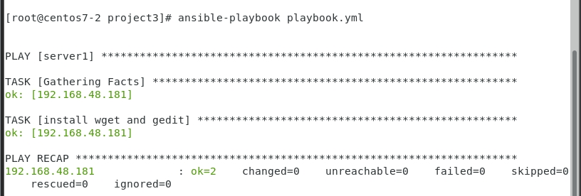
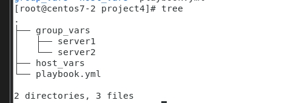
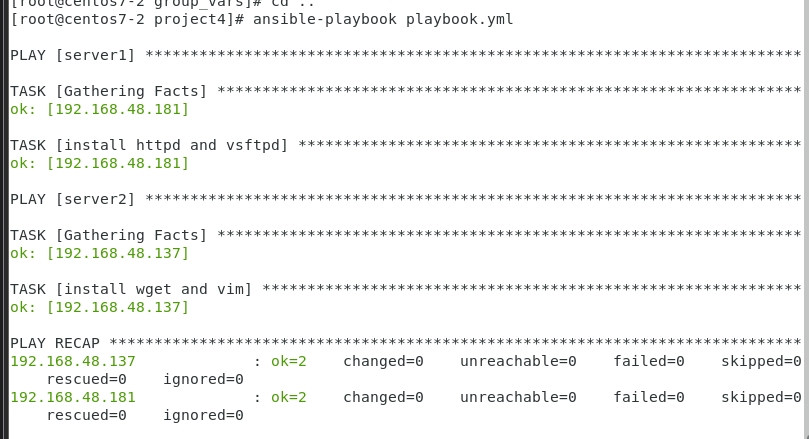
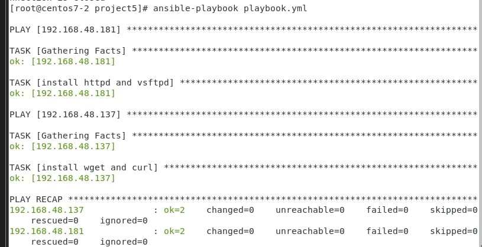
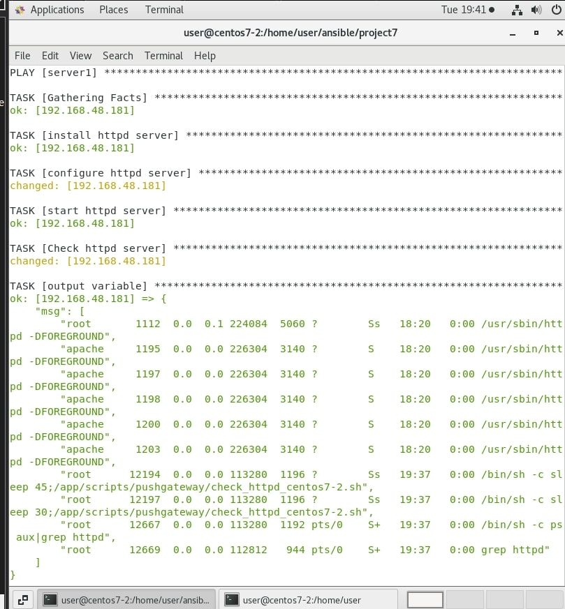
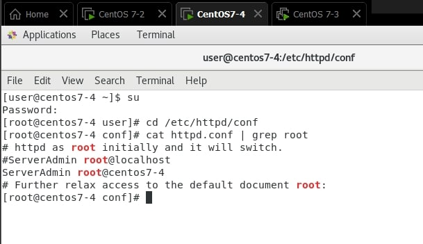
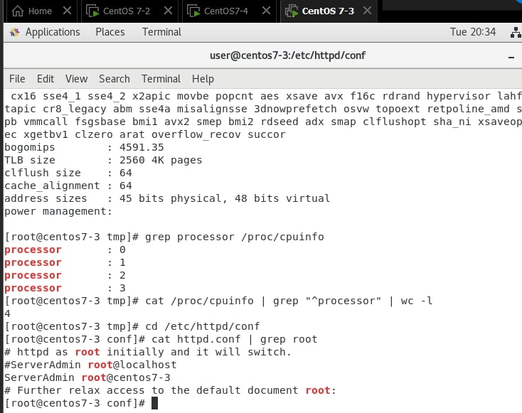

## ansible 
- 位置在上周老師給的ansible中的ansible/project3

- cd ansible/project3

- ansible-playbook playbool.yml




---

### project4
- 職場上可能會遇到大量的伺服器，會分不同的群組
所以在project4的group_vars

- 在project4的結構如下


- playbook.yml
  ```
  - hosts: server1
    tasks:
      - name: install {{ app1 }} and {{ app2 }}
        yum:
          name:
            - "{{ app1 }}"
            - "{{ app2 }}"
          state: present

  - hosts: server2
    tasks:
      - name: install {{ app1 }} and {{ app2 }}
        yum:
          name:
            - "{{ app1 }}"
            - "{{ app2 }}"
          state: present
  ```

- server1
  ```
  app1: httpd
  app2: vsftpd
  ```

- server2
  ```
  app1: wget
  app2: vim
  ```

- `ansible-playbook playbook.yml`

  


---

### project5

- 結構(group_vars裡面是空的)
  ```
  [root@centos7-2 project5]# tree
  .
  ├── group_vars
  ├── host_vars
  │   ├── 192.168.48.137
  │   └── 192.168.48.181
  └── playbook.yml

  2 directories, 3 files

  ```
- playbook.yml
  ```
  - hosts: 192.168.48.181
    tasks:
      - name: install {{ app1 }} and {{ app2 }}
        yum:
          name:
            - "{{ app1 }}"
            - "{{ app2 }}"
          state: present

  - hosts: 192.168.48.137
    tasks:
      - name: install {{ app1 }} and {{ app2 }}
        yum:
          name:
            - "{{ app1 }}"
            - "{{ app2 }}"
          state: present
  ```

- 192.168.48.137
  ```
  app1: wget
  app2: curl
  ```

- 192.168.48.181
  ```
  app1: httpd
  app2: vsftpd
  ```

- `ansible-playbook playbook.yml`

---

### project5-1
- 結構
  ```
  [root@centos7-2 project5-1]# tree
  .
  ├── group_vars
  │   └── servers
  ├── host_vars
  │   ├── 192.168.48.137
  │   └── 192.168.48.181
  └── playbook.yml

  ```

- playbook.yml
  ```
  - hosts: servers
    tasks:
      - name: install {{ app }}
        yum:
          name:
            - "{{ app }}"
          state: present
  - hosts: 192.168.48.181
    tasks:
      - name: install {{ app1 }} and {{ app2 }}
        yum:
          name:
            - "{{ app1 }}"
            - "{{ app2 }}"
          state: present

  - hosts: 192.168.48.137
    tasks:
      - name: install {{ app1 }} and {{ app2 }}
        yum:
          name:
            - "{{ app1 }}"
            - "{{ app2 }}"
          state: present
  ```

- group_vars/servers
  ```
  app: curl

  ```

- 192.168.48.137
  ```
  app1: wget
  app2: curl
  ```

- 192.168.48.181
  ```
  app1: httpd
  app2: vsftpd
  ```


- `ansible-playbook playbook.yml`

---

### project6
- 載明另列將變數的質加進去

- 結構
  ```
  [root@centos7-2 project6]# tree
  .
  ├── playbook.yml
  └── vars_public.yml


  ```

- playbook.yml
  ```
  - hosts: "{{ host }}"
    vars_files: ./vars_public.yml

    tasks:
      - name: install {{ app1 }} and {{ app2 }}
        yum:
          name:
            - "{{ app1 }}"
            - "{{ app2 }}"
          state: present
  ```

- vars_public.yml
  ```
  app1: wget
  app2: gedit
  ```

- `ansible-playbook -e host=servers playbook.yml`


### project7
- 結構
  ```
  [root@centos7-2 project7]# tree
  .
  ├── httpd.conf
  └── playbook.yml

  0 directories, 2 files

  ```

- httpd.conf
  ```
  #
  # This is the main Apache HTTP server configuration file.  It contains the
  # configuration directives that give the server its instructions.
  # See <URL:http://httpd.apache.org/docs/2.4/> for detailed information.
  # In particular, see 
  # <URL:http://httpd.apache.org/docs/2.4/mod/directives.html>
  # for a discussion of each configuration directive.
  #
  # Do NOT simply read the instructions in here without understanding
  # what they do.  They're here only as hints or reminders.  If you are unsure
  # consult the online docs. You have been warned.  
  #
  # Configuration and logfile names: If the filenames you specify for many
  # of the server's control files begin with "/" (or "drive:/" for Win32), the
  # server will use that explicit path.  If the filenames do *not* begin
  # with "/", the value of ServerRoot is prepended -- so 'log/access_log'
  # with ServerRoot set to '/www' will be interpreted by the
  # server as '/www/log/access_log', where as '/log/access_log' will be
  # interpreted as '/log/access_log'.

  #
  # ServerRoot: The top of the directory tree under which the server's
  # configuration, error, and log files are kept.
  #
  # Do not add a slash at the end of the directory path.  If you point
  # ServerRoot at a non-local disk, be sure to specify a local disk on the
  # Mutex directive, if file-based mutexes are used.  If you wish to share the
  # same ServerRoot for multiple httpd daemons, you will need to change at
  # least PidFile.
  #
  ServerRoot "/etc/httpd"

  #
  # Listen: Allows you to bind Apache to specific IP addresses and/or
  # ports, instead of the default. See also the <VirtualHost>
  # directive.
  #
  # Change this to Listen on specific IP addresses as shown below to 
  # prevent Apache from glomming onto all bound IP addresses.
  #
  #Listen 12.34.56.78:80
  Listen 8082

  #
  # Dynamic Shared Object (DSO) Support
  #
  # To be able to use the functionality of a module which was built as a DSO you
  # have to place corresponding `LoadModule' lines at this location so the
  # directives contained in it are actually available _before_ they are used.
  # Statically compiled modules (those listed by `httpd -l') do not need
  # to be loaded here.
  #
  # Example:
  # LoadModule foo_module modules/mod_foo.so
  #
  Include conf.modules.d/*.conf

  #
  # If you wish httpd to run as a different user or group, you must run
  # httpd as root initially and it will switch.  
  #
  # User/Group: The name (or #number) of the user/group to run httpd as.
  # It is usually good practice to create a dedicated user and group for
  # running httpd, as with most system services.
  #
  User apache
  Group apache

  # 'Main' server configuration
  #
  # The directives in this section set up the values used by the 'main'
  # server, which responds to any requests that aren't handled by a
  # <VirtualHost> definition.  These values also provide defaults for
  # any <VirtualHost> containers you may define later in the file.
  #
  # All of these directives may appear inside <VirtualHost> containers,
  # in which case these default settings will be overridden for the
  # virtual host being defined.
  #

  #
  # ServerAdmin: Your address, where problems with the server should be
  # e-mailed.  This address appears on some server-generated pages, such
  # as error documents.  e.g. admin@your-domain.com
  #
  ServerAdmin root@localhost

  #
  # ServerName gives the name and port that the server uses to identify itself.
  # This can often be determined automatically, but we recommend you specify
  # it explicitly to prevent problems during startup.
  #
  # If your host doesn't have a registered DNS name, enter its IP address here.
  #
  #ServerName www.example.com:80

  #
  # Deny access to the entirety of your server's filesystem. You must
  # explicitly permit access to web content directories in other 
  # <Directory> blocks below.
  #
  <Directory />
      AllowOverride none
      Require all denied
  </Directory>

  #
  # Note that from this point forward you must specifically allow
  # particular features to be enabled - so if something's not working as
  # you might expect, make sure that you have specifically enabled it
  # below.
  #

  #
  # DocumentRoot: The directory out of which you will serve your
  # documents. By default, all requests are taken from this directory, but
  # symbolic links and aliases may be used to point to other locations.
  #
  DocumentRoot "/var/www/html"

  #
  # Relax access to content within /var/www.
  #
  <Directory "/var/www">
      AllowOverride None
      # Allow open access:
      Require all granted
  </Directory>

  # Further relax access to the default document root:
  <Directory "/var/www/html">
      #
      # Possible values for the Options directive are "None", "All",
      # or any combination of:
      #   Indexes Includes FollowSymLinks SymLinksifOwnerMatch ExecCGI MultiViews
      #
      # Note that "MultiViews" must be named *explicitly* --- "Options All"
      # doesn't give it to you.
      #
      # The Options directive is both complicated and important.  Please see
      # http://httpd.apache.org/docs/2.4/mod/core.html#options
      # for more information.
      #
      Options Indexes FollowSymLinks

      #
      # AllowOverride controls what directives may be placed in .htaccess files.
      # It can be "All", "None", or any combination of the keywords:
      #   Options FileInfo AuthConfig Limit
      #
      AllowOverride None

      #
      # Controls who can get stuff from this server.
      #
      Require all granted
  </Directory>

  #
  # DirectoryIndex: sets the file that Apache will serve if a directory
  # is requested.
  #
  <IfModule dir_module>
      DirectoryIndex index.html
  </IfModule>

  #
  # The following lines prevent .htaccess and .htpasswd files from being 
  # viewed by Web clients. 
  #
  <Files ".ht*">
      Require all denied
  </Files>

  #
  # ErrorLog: The location of the error log file.
  # If you do not specify an ErrorLog directive within a <VirtualHost>
  # container, error messages relating to that virtual host will be
  # logged here.  If you *do* define an error logfile for a <VirtualHost>
  # container, that host's errors will be logged there and not here.
  #
  ErrorLog "logs/error_log"

  #
  # LogLevel: Control the number of messages logged to the error_log.
  # Possible values include: debug, info, notice, warn, error, crit,
  # alert, emerg.
  #
  LogLevel warn

  <IfModule log_config_module>
      #
      # The following directives define some format nicknames for use with
      # a CustomLog directive (see below).
      #
      LogFormat "%h %l %u %t \"%r\" %>s %b \"%{Referer}i\" \"%{User-Agent}i\"" combined
      LogFormat "%h %l %u %t \"%r\" %>s %b" common

      <IfModule logio_module>
        # You need to enable mod_logio.c to use %I and %O
        LogFormat "%h %l %u %t \"%r\" %>s %b \"%{Referer}i\" \"%{User-Agent}i\" %I %O" combinedio
      </IfModule>

      #
      # The location and format of the access logfile (Common Logfile Format).
      # If you do not define any access logfiles within a <VirtualHost>
      # container, they will be logged here.  Contrariwise, if you *do*
      # define per-<VirtualHost> access logfiles, transactions will be
      # logged therein and *not* in this file.
      #
      #CustomLog "logs/access_log" common

      #
      # If you prefer a logfile with access, agent, and referer information
      # (Combined Logfile Format) you can use the following directive.
      #
      CustomLog "logs/access_log" combined
  </IfModule>

  <IfModule alias_module>
      #
      # Redirect: Allows you to tell clients about documents that used to 
      # exist in your server's namespace, but do not anymore. The client 
      # will make a new request for the document at its new location.
      # Example:
      # Redirect permanent /foo http://www.example.com/bar

      #
      # Alias: Maps web paths into filesystem paths and is used to
      # access content that does not live under the DocumentRoot.
      # Example:
      # Alias /webpath /full/filesystem/path
      #
      # If you include a trailing / on /webpath then the server will
      # require it to be present in the URL.  You will also likely
      # need to provide a <Directory> section to allow access to
      # the filesystem path.

      #
      # ScriptAlias: This controls which directories contain server scripts. 
      # ScriptAliases are essentially the same as Aliases, except that
      # documents in the target directory are treated as applications and
      # run by the server when requested rather than as documents sent to the
      # client.  The same rules about trailing "/" apply to ScriptAlias
      # directives as to Alias.
      #
      ScriptAlias /cgi-bin/ "/var/www/cgi-bin/"

  </IfModule>

  #
  # "/var/www/cgi-bin" should be changed to whatever your ScriptAliased
  # CGI directory exists, if you have that configured.
  #
  <Directory "/var/www/cgi-bin">
      AllowOverride None
      Options None
      Require all granted
  </Directory>

  <IfModule mime_module>
      #
      # TypesConfig points to the file containing the list of mappings from
      # filename extension to MIME-type.
      #
      TypesConfig /etc/mime.types

      #
      # AddType allows you to add to or override the MIME configuration
      # file specified in TypesConfig for specific file types.
      #
      #AddType application/x-gzip .tgz
      #
      # AddEncoding allows you to have certain browsers uncompress
      # information on the fly. Note: Not all browsers support this.
      #
      #AddEncoding x-compress .Z
      #AddEncoding x-gzip .gz .tgz
      #
      # If the AddEncoding directives above are commented-out, then you
      # probably should define those extensions to indicate media types:
      #
      AddType application/x-compress .Z
      AddType application/x-gzip .gz .tgz

      #
      # AddHandler allows you to map certain file extensions to "handlers":
      # actions unrelated to filetype. These can be either built into the server
      # or added with the Action directive (see below)
      #
      # To use CGI scripts outside of ScriptAliased directories:
      # (You will also need to add "ExecCGI" to the "Options" directive.)
      #
      #AddHandler cgi-script .cgi

      # For type maps (negotiated resources):
      #AddHandler type-map var

      #
      # Filters allow you to process content before it is sent to the client.
      #
      # To parse .shtml files for server-side includes (SSI):
      # (You will also need to add "Includes" to the "Options" directive.)
      #
      AddType text/html .shtml
      AddOutputFilter INCLUDES .shtml
  </IfModule>

  #
  # Specify a default charset for all content served; this enables
  # interpretation of all content as UTF-8 by default.  To use the 
  # default browser choice (ISO-8859-1), or to allow the META tags
  # in HTML content to override this choice, comment out this
  # directive:
  #
  AddDefaultCharset UTF-8

  <IfModule mime_magic_module>
      #
      # The mod_mime_magic module allows the server to use various hints from the
      # contents of the file itself to determine its type.  The MIMEMagicFile
      # directive tells the module where the hint definitions are located.
      #
      MIMEMagicFile conf/magic
  </IfModule>

  #
  # Customizable error responses come in three flavors:
  # 1) plain text 2) local redirects 3) external redirects
  #
  # Some examples:
  #ErrorDocument 500 "The server made a boo boo."
  #ErrorDocument 404 /missing.html
  #ErrorDocument 404 "/cgi-bin/missing_handler.pl"
  #ErrorDocument 402 http://www.example.com/subscription_info.html
  #

  #
  # EnableMMAP and EnableSendfile: On systems that support it, 
  # memory-mapping or the sendfile syscall may be used to deliver
  # files.  This usually improves server performance, but must
  # be turned off when serving from networked-mounted 
  # filesystems or if support for these functions is otherwise
  # broken on your system.
  # Defaults if commented: EnableMMAP On, EnableSendfile Off
  #
  #EnableMMAP off
  EnableSendfile on

  # Supplemental configuration
  #
  # Load config files in the "/etc/httpd/conf.d" directory, if any.
  IncludeOptional conf.d/*.conf
  ```

- playbook.yml
  ```
  - hosts: server1
    tasks:
      - name: install httpd server
        yum: name=httpd state=present

      - name: configure httpd server
        copy: src=./httpd.conf dest=/etc/httpd/conf/httpd.conf
        notify: restart httpd server

      - name: start httpd server
        service: name=httpd state=started enabled=yes

      - name: Check httpd server
        shell: ps aux|grep httpd
        register: check_httpd
      
      - name: output variable
        debug:
          msg: "{{ check_httpd.stdout_lines }}"

      - name: get the MemTotal
        shell: cat /proc/meminfo | grep MemTotal | awk '{print $2}'
        register: memTotal

      - name: xxxx
        copy: content="{{ memTotal.stdout_lines }}" dest="/tmp/mem.txt"

      - name: get the CPU
        shell: cat /proc/cpuinfo | grep "^processor" | wc -l
        register: CPU

    handlers:
      - name: restart httpd server
        service: name=httpd state=restarted
  ```

- `ansible-playbook  playbook.yml`



### project8

- for centos7-4
- `cd /etc/httpd/conf`
- `cat httpd.conf | grep root`



- for centos7-3
- `grep processor /proc/cpuinfo`
- `cat /proc/cpuinfo | grep "^processor" | wc -l`
- `cd /etc/httpd/conf`
- `cat httpd.conf | grep root`


